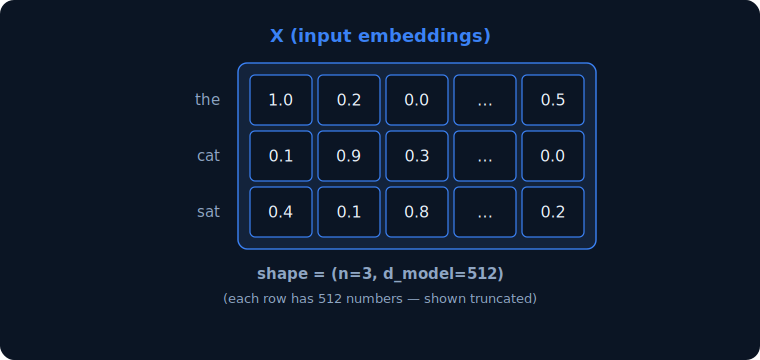
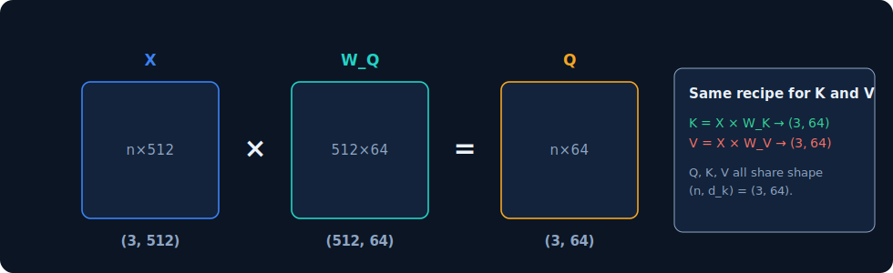
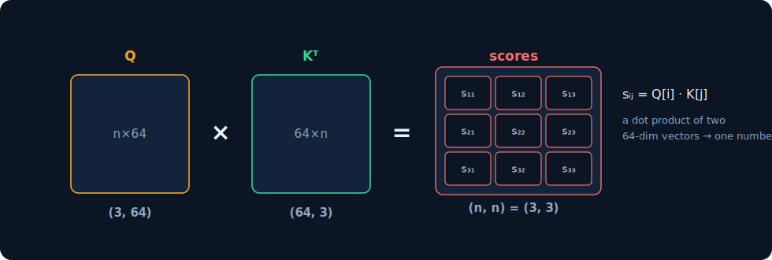
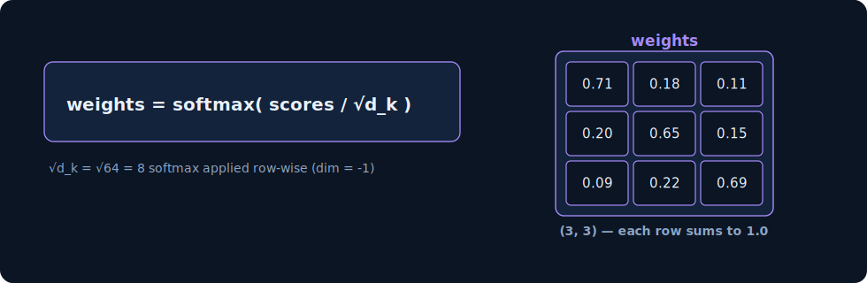
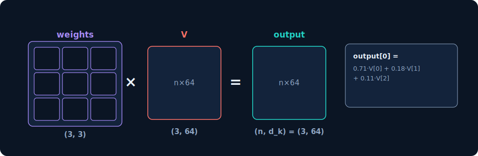
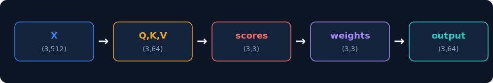

# Inside one Attention Head

*Every matrix and vector, with its exact dimensions — using a real GPT-style configuration.*

`n = 3` tokens &nbsp;&nbsp;•&nbsp;&nbsp; `d_model = 512` model width &nbsp;&nbsp;•&nbsp;&nbsp; `d_k = 64` per-head dim

---

## Slide 2 — Setup: What `d_model` and `d_k` actually mean

*Two different widths. One is the model's; the other is a single head's slice of it.*

### `d_model = 512`

The width of a token's embedding — how many numbers represent each token as it flows through the model.

Every layer's input and output is `(n, d_model)`. It is the same for the whole model.

### `d_k = 64`

The width of the query/key vectors inside **one** head — the smaller space each head projects into.

`W_Q`, `W_K` each have shape `(d_model, d_k)`, so they map 512 → 64 for this head.

### How they relate

```
d_k = d_model / num_heads   =   512 / 8   =   64
```

The model splits its 512-wide representation across 8 heads. Each head works in its own 64-dim slice, then all 8 outputs are concatenated back to 512. `d_k` is not chosen freely — it is forced by this split.

> This slide's numbers (512, 8 heads, 64) are a standard configuration — e.g. the original Transformer base model. We follow just one of the 8 heads from here on.

---

## Slide 3 — Input: token embeddings

*Each of the n = 3 tokens is a row; each row is a d_model = 512 vector. Together they form X.*



Rows are tokens (`the`, `cat`, `sat`); each row holds 512 numbers (shown truncated with `…`).

> X is what the layer receives. Every matrix in this head is derived from X — nothing else is fed in.

---

## Slide 4 — Step 1: project X into Q, K, V

*Three learned weight matrices, each `(d_model=512, d_k=64)`, map every 512-vector down to a 64-vector.*



```
Q = X × W_Q  → (3, 64)
K = X × W_K  → (3, 64)
V = X × W_V  → (3, 64)
```

Q, K, V all share shape `(n, d_k) = (3, 64)`.

> `(3,512) × (512,64) = (3,64)`: the inner 512 cancels. This is where each token's 512-vector becomes a 64-dim query, key and value.

---

## Slide 5 — Step 2: raw attention scores

*Multiply Q by K transposed. The shared d_k = 64 cancels, leaving one score per token pair.*



```
sᵢⱼ = Q[i] · K[j]
```

A dot product of two 64-dim vectors → one number.

> Note the shape collapses to `(3,3)`: the 64-dim head vectors disappear into scalars. The result is one square attention grid over the 3 tokens.

---

## Slide 6 — Step 3: scale, then softmax

*Divide by √d_k, then softmax each row into a probability distribution over the tokens.*


$$weights = \text{softmax}\left(\frac{\text{scores}}{\sqrt{d_k}}\right)$$


`√d_k = √64 = 8` — softmax applied row-wise (`dim = -1`).



> Dividing by √64 = 8 keeps the dot products from growing large (they sum over 64 terms), which would otherwise make softmax gradients vanish. Row 1: "the" attends 71% to itself.

---

## Slide 7 — Step 4: weighted sum of values

*Multiply the weights by V. Each output row is a blend of all value vectors, back in 64-dim space.*



```
output[0] = 0.71·V[0] + 0.18·V[1] + 0.11·V[2]
```

> `(3,3) × (3,64) = (3,64)`. Each token gets one refined 64-dim vector. This is this head's output — one of 8 that will be concatenated back to 512.

---

## Slide 8 — Recap: the whole head, end to end

*Widths flow: 512 in → project to 64 → attend → 64 out. Repeat across 8 heads, concat back to 512.*



```python
import math, torch

d_model, num_heads = 512, 8        # d_k = 512 // 8 = 64

def attention_head(X, W_Q, W_K, W_V):   # W_* are (512, 64)
    Q = X @ W_Q                  # (3,512)@(512,64) -> (3,64)
    K = X @ W_K                  # (3,64)
    V = X @ W_V                  # (3,64)
    scores  = Q @ K.T            # (3,64)@(64,3) -> (3,3)
    weights = torch.softmax(scores / math.sqrt(Q.shape[-1]), dim=-1)
    output  = weights @ V        # (3,3)@(3,64) -> (3,64)
    return output, weights
```
