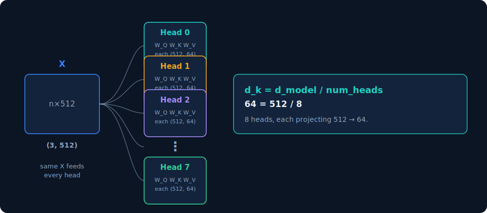
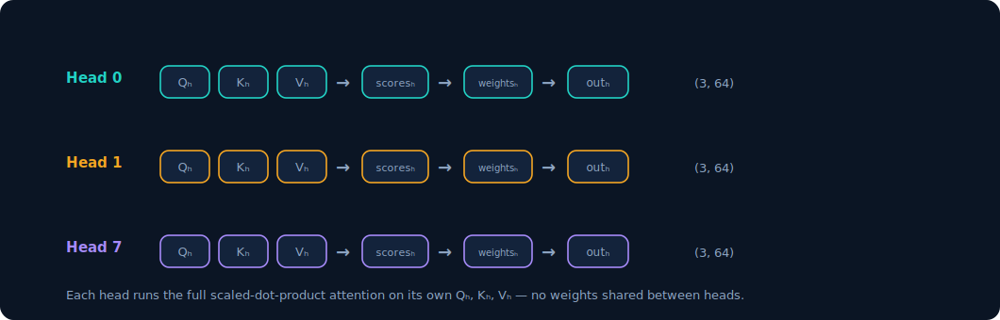
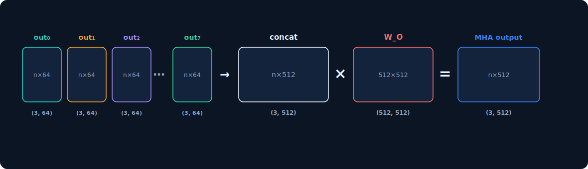
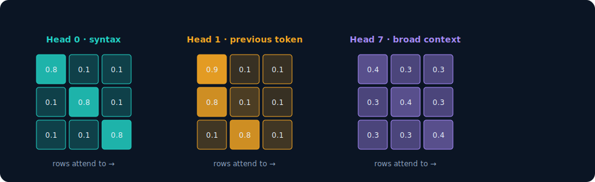
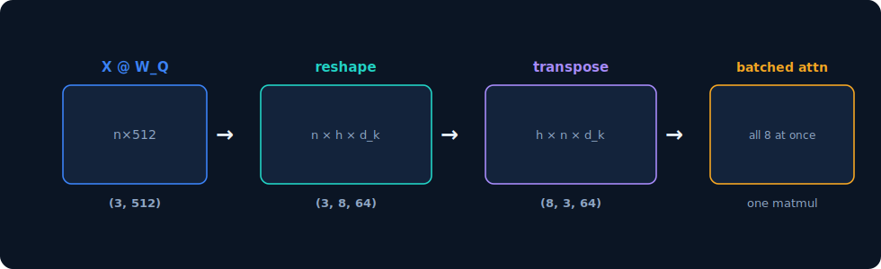
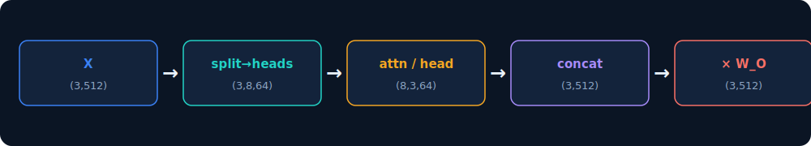

# Multi-Head Attention


## Slide 1 

*How h attention heads run in parallel and recombine — building on the single-head walkthrough.*

`n = 3` tokens &nbsp;&nbsp;•&nbsp;&nbsp; `d_model = 512` model width &nbsp;&nbsp;•&nbsp;&nbsp; `num_heads = 8` &nbsp;&nbsp;•&nbsp;&nbsp; `d_k = 64` per-head dim

> Recap of one head: `X (3,512)` → project to `Q, K, V (3,64)` → `scores (3,3)` → `softmax` → `output (3,64)`. Multi-head attention runs eight of these side by side.

---

## Slide 2 — Setup: split `d_model` across heads

*Instead of one wide attention, use 8 heads — each with its own smaller slice of the representation.*



The same input `X (3, 512)` feeds **every** head. What differs is the weights: each head `h` has its own `W_Qₕ`, `W_Kₕ`, `W_Vₕ`, each of shape `(512, 64)`.

```
d_k = d_model / num_heads   =   512 / 8   =   64
```

> `d_k` is not chosen freely — the division by `num_heads` is what lets the concatenated heads restore the original width later. Total compute stays roughly the same as one 512-wide attention.

---

## Slide 3 — Step 1: each head attends independently

*Every head runs the exact same scaled-dot-product attention from the single-head deck — just on its own Q, K, V.*



For each head `h`:

```
Qₕ = X @ W_Qₕ        # (3, 64)
Kₕ = X @ W_Kₕ        # (3, 64)
Vₕ = X @ W_Vₕ        # (3, 64)
scoresₕ  = Qₕ @ Kₕ.T                        # (3, 3)
weightsₕ = softmax(scoresₕ / sqrt(d_k))     # (3, 3)
outₕ     = weightsₕ @ Vₕ                     # (3, 64)
```

> No weights and no attention patterns are shared between heads. This independence is exactly what lets each head specialize.

---

## Slide 4 — Step 2: concatenate and project

*Stick all 8 head outputs back together to width 512, then mix them with one more learned matrix.*



```
concat = [out₀ | out₁ | … | out₇]     # (3, 64) × 8  ->  (3, 512)
MHA    = concat @ W_O                  # (3,512) @ (512,512) -> (3, 512)
```

The concatenation glues the eight `(3, 64)` outputs side by side back to `(3, 512)`. The final projection `W_O (512, 512)` lets the heads' results interact before leaving the layer.

> Output shape `(3, 512)` matches the input `X` — so multi-head attention slots cleanly into the residual stream, and layers can stack.

---

## Slide 5 — Why multiple heads: specialization

*Because each head has its own weights, each learns a different attention pattern.*



Each grid is a head's `weights (3, 3)` — darker means stronger attention. Real trained models show heads that specialize in things like attending to the previous token, matching syntactic dependencies, or spreading attention broadly for context. (The labels here are illustrative — heads are not hand-assigned roles; they emerge from training.)

> One wide head could only learn one averaged pattern. Eight narrow heads can capture eight different relationships at once, then combine them.

---

## Slide 6 — In practice: one batched tensor, not a loop

*Real implementations never loop over heads in Python — they reshape and run all heads as a single batched matmul.*



`W_Q`, `W_K`, `W_V` are single `(512, 512)` matrices. After projecting, the result is *reshaped* to split the 512 into `8 × 64`, then transposed so heads become a batch dimension:

```
Q = (X @ W_Q).view(n, num_heads, d_k).transpose(0, 1)   # (8, 3, 64)
```

All 8 heads then attend in one batched operation on the GPU. Same math as the parallel pipelines on slide 3 — just far faster.

---

## Slide 7 — Recap: the whole layer, end to end

*Widths flow: 512 in → split into 8×64 → attend per head → concat back to 512 → mix with W_O → 512 out.*



```python
import math, torch
import torch.nn.functional as F

d_model, num_heads = 512, 8
d_k = d_model // num_heads                     # 64

def multi_head_attention(X, W_Q, W_K, W_V, W_O):
    n = X.shape[0]
    # one big projection each, then split into heads
    def split(M):                              # (n, 512) -> (h, n, 64)
        return M.view(n, num_heads, d_k).transpose(0, 1)
    Q, K, V = split(X @ W_Q), split(X @ W_K), split(X @ W_V)

    scores  = Q @ K.transpose(-2, -1) / math.sqrt(d_k)   # (h, n, n)
    weights = F.softmax(scores, dim=-1)                  # (h, n, n)
    heads   = weights @ V                                # (h, n, 64)

    concat  = heads.transpose(0, 1).reshape(n, d_model)  # (n, 512)
    return concat @ W_O                                  # (n, 512)
```


### Is W_O learned or predefined?

**W_O is learned** — it's a trainable parameter matrix, exactly like W_Q, W_K, W_V. Nothing about it is fixed or hand-designed. It starts as random numbers and gets updated by gradient descent during training, just like every other weight in the network. Same goes for all the per-head projections. The _only_ things that are predefined in multi-head attention are the **hyperparameters** — `d_model`, `num_heads`, and therefore `d_k` — plus the structural operations (the matrix multiplies, the softmax, the reshape). The actual numbers inside every W matrix are learned.

### What is W_O's purpose?

After you concatenate the 8 head outputs, you have a `(3, 512)` matrix — but it's just the heads stapled together side by side. Dimensions 0–63 came from head 0, dimensions 64–127 from head 1, and so on. At that point the heads haven't _communicated_ — each block is that head's private opinion, sitting in its own slice.

W_O `(512, 512)` does two things:

1. **Mixes the heads together.** Because it's a full 512×512 matrix, every output dimension is a weighted combination of _all_ 512 concatenated values — so information from head 0 can influence the same output position as head 3. Without W_O, the heads would remain in permanently separate lanes and could never combine their findings. W_O is where "head 2 found the subject, head 5 found the verb, now blend those into one representation" actually happens.
2. **Projects back into the residual stream's basis.** The concatenated vector lives in a somewhat arbitrary space (whatever each head happened to produce). W_O learns to map that into the `d_model`-space that the rest of the network expects to read.

A useful way to see it: `concat @ W_O` is mathematically equivalent to summing each head's output through its own smaller `(64, 512)` projection. So you can think of W_O as _"each head also learns how to write its 64-dim result back into the full 512-dim model."_ The concat-then-multiply form is just the efficient way to express that.

### What makes each head learn _different_ weights?

This is the subtle one, because here's the puzzle: every head has the identical architecture, receives the identical input X, and is trained with the identical loss. So why don't all 8 heads converge to the same thing?

The answer is **random initialization + symmetry breaking**.

At the very start of training, each head's `W_Qₕ`, `W_Kₕ`, `W_Vₕ` are filled with _different_ random numbers. This is the crucial seed. If you initialized all 8 heads to the _exact same_ values, they genuinely would stay identical forever — they'd receive identical gradients on every step and update in lockstep, learning nothing distinct. That's a real failure mode called symmetry that random init exists specifically to prevent.

Because they start at different random points:

- Head 0 and head 3 compute different Q/K/V from the same X, so they produce different attention patterns from step one.
- They therefore contribute differently to the final output, so they receive **different gradients** during backpropagation.
- Different gradients push them toward different regions of weight-space.

Then a second force takes over during training: **the loss rewards diversity.** If two heads ended up learning the same pattern, one of them is redundant — the model is wasting capacity, and it could lower the loss by having that head do something else useful instead. So gradient descent naturally pressures the heads to specialize and cover different relationships (one tracks the previous token, one matches syntactic dependencies, one attends broadly, etc.). There's no supervision telling head 1 "you handle previous-token" — that division of labor _emerges_ because it's the configuration that minimizes loss.

So to be precise about the earlier deck's specialization slide: nobody assigns roles to heads. The roles are an emergent consequence of (a) different random starting points breaking the symmetry, and (b) the loss rewarding heads that aren't redundant with each other.

One caveat worth knowing: this emergent specialization is real but messy. In trained models, heads aren't cleanly one-role-each — some are interpretable (researchers have found identifiable "induction heads," "previous-token heads," etc.), many are polysemantic or partly redundant, and some can be pruned after training with little loss. The clean "syntax head / context head" story is a useful intuition, not a literal guarantee about every head.

@end