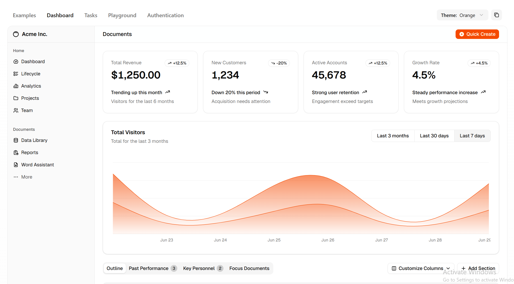

# Shadcn UI
https://github.com/shadcn-ui/ui

A set of beautifully-designed, accessible components and a code distribution platform. Works with your favorite frameworks. Open Source. Open Code.

2025 11 19 - star 100K fork 7.2k

A set of beautifully designed components that you can customize, extend, and build on. Start here then make it your own. Open Source. Open Code. Use this to build your own component library.

## doc
https://ui.shadcn.com/docs

## official website

### The AI-Native shadcn/ui component library For React Developers
The ultimate shadcn/ui resource for React developers. Essential UI components, advanced patterns, and AI integrations. From buttons to AI chat interfaces - everything you need to build modern applications.